# Architecture After Migration

```mermaid
graph TB
    subgraph "Hybrid Connect/Forge App"
        subgraph "Connect Backend (Modernized)"
            ExpressNew["Express 5.1.0<br/>Zero Vulnerabilities<br/>Modern ES6+ Patterns"]
            MustacheSecure["Mustache 4.2.0<br/>(Secure Template Engine)"]
            ConnectAPI["Connect API Routes<br/>Backward Compatibility<br/>Hybrid Integration"]
        end
        
        subgraph "Forge Platform"
            ForgeManifest["Forge Manifest<br/>• Preserved Module Keys<br/>• Modern Permissions<br/>• CustomUI Resources"]
            ForgeMacros["Forge Macros<br/>• paste-code-macro<br/>• gist-code-macro<br/>• bitbucket-snippet-code-macro<br/>• in-page-editor (NEW)"]
        end
        
        subgraph "CustomUI Components (React)"
            PasteCode["Paste Code Macro<br/>• React 18<br/>• 70+ Verified Themes<br/>• Dark Mode Support<br/>• Dynamic Theme Loading"]
            GistMacro["GitHub Gist Macro<br/>• URL Parsing<br/>• GitHub API Integration<br/>• Responsive Design"]
            BitbucketSnippet["Bitbucket Snippet<br/>• Snippet Embedding<br/>• Modern UI Components"]
            InPageEditor["In-Page Editor (NEW)<br/>• Live Code Editing<br/>• Monaco Integration<br/>• Full Theme Support"]
        end
    end
    
    subgraph "Modern Build System"
        ParallelBuilds["Parallel Build Pipelines<br/>• Node 22<br/>• 4 Independent Webpack Builds<br/>• Atlassian Artifactory<br/>• Zero Conflicts"]
        SecurityFirst["Security-First Approach<br/>• Zero Vulnerabilities<br/>• Modern Dependencies<br/>• Automated Auditing"]
    end
    
    subgraph "Advanced Theme System"
        ThemeEngine["Dynamic Theme Engine<br/>• 70+ Verified CDN URLs<br/>• Human-Readable Mappings<br/>• CSP Compliance<br/>• Error Handling"]
        DarkMode["Dark Mode Support<br/>• Theme Inheritance<br/>• Background Matching<br/>• Contrast Optimization<br/>• User Preferences"]
        ThemePreview["Live Theme Preview<br/>• Instant Switching<br/>• No Page Reload<br/>• Visual Feedback"]
    end
    
    subgraph "Security & Performance"
        ZeroVulns["Zero Vulnerabilities<br/>• Express 5.1.0<br/>• Secure Dependencies<br/>• Regular Auditing"]
        ModernJS["Modern JavaScript<br/>• ES6+ Modules<br/>• Async/Await<br/>• Clean Error Handling"]
        CSPCompliance["CSP Compliance<br/>• cdnjs.cloudflare.com<br/>• Verified External Resources<br/>• Security Headers"]
    end
    
    subgraph "User Experience"
        ModernUI["Modern React UI<br/>• Interactive Components<br/>• Real-time Updates<br/>• Responsive Design"]
        ThemeCustomization["Advanced Theming<br/>• 70+ Options<br/>• Dark/Light Modes<br/>• Live Preview<br/>• User Preferences"]
        NewFeatures["Enhanced Features<br/>• Live Code Editing<br/>• Advanced Syntax Highlighting<br/>• Copy-to-Clipboard<br/>• Accessibility Support"]
    end

    ExpressNew --> ConnectAPI
    ConnectAPI --> ForgeMacros
    MustacheSecure --> ConnectAPI
    ForgeManifest --> ForgeMacros
    
    ForgeMacros --> PasteCode
    ForgeMacros --> GistMacro
    ForgeMacros --> BitbucketSnippet
    ForgeMacros --> InPageEditor
    
    ParallelBuilds --> PasteCode
    ParallelBuilds --> GistMacro
    ParallelBuilds --> BitbucketSnippet
    ParallelBuilds --> InPageEditor
    
    ThemeEngine --> DarkMode
    ThemeEngine --> ThemePreview
    DarkMode --> PasteCode
    DarkMode --> InPageEditor
    
    ZeroVulns --> ExpressNew
    ModernJS --> ExpressNew
    CSPCompliance --> ThemeEngine
    
    ModernUI --> ThemeCustomization
    ThemeCustomization --> NewFeatures
    
    classDef secure fill:#d4edda,stroke:#28a745,stroke-width:2px
    classDef modern fill:#cce5ff,stroke:#007bff,stroke-width:2px
    classDef enhanced fill:#e7f3ff,stroke:#17a2b8,stroke-width:2px
    classDef new fill:#fff2cc,stroke:#fd7e14,stroke-width:2px
    
    class ExpressNew,MustacheSecure,ZeroVulns,CSPCompliance secure
    class ModernJS,ParallelBuilds,ModernUI,ThemeEngine modern
    class ThemeCustomization,NewFeatures,ThemePreview enhanced
    class InPageEditor,DarkMode new
```

## Key Characteristics (After)

### **Hybrid Architecture**
- **Connect + Forge Integration**: Best of both platforms with backward compatibility
- **Preserved Module Keys**: Zero breaking changes for existing users
- **Modern React CustomUI**: Interactive components with advanced theming

### **Security Excellence**
- **Zero Vulnerabilities**: Complete security posture improvement
- **Express 5.1.0**: Latest framework with modern security practices
- **Secure Dependencies**: Eliminated 75+ vulnerable packages

### **Advanced Theme System**
- **70+ Verified Themes**: All CDN URLs tested and mapped
- **Dark Mode Support**: Comprehensive dark/light theme implementation
- **Dynamic Loading**: Real-time theme switching without page reload
- **CSP Compliance**: Secure external resource management

### **Modern Development Experience**
- **Parallel Build Pipelines**: 4 independent webpack builds for optimal performance
- **Node 22 Support**: Latest runtime with improved performance
- **ES6+ Patterns**: Modern JavaScript throughout the codebase
- **Zero Build Conflicts**: Isolated component development

### **Enhanced User Experience**
- **Interactive React Components**: Rich, responsive user interfaces
- **Live Code Editing**: New in-page editor with Monaco integration
- **Advanced Syntax Highlighting**: Professional-grade code presentation
- **Accessibility Support**: WCAG compliance and keyboard navigation

### **Future-Proof Foundation**
- **Migration Ready**: Clear path to full Forge when needed
- **Scalable Architecture**: Component-based design for easy expansion
- **Modern Toolchain**: Industry-standard build and deployment processes