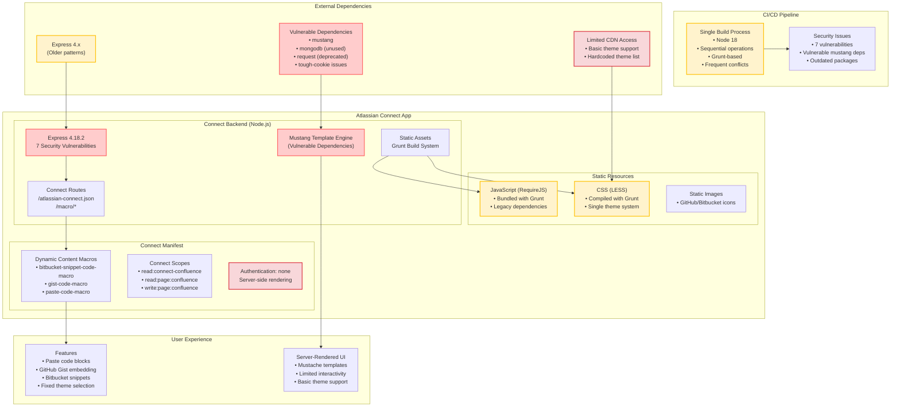

# Architecture Before Migration

## Key Characteristics (Before)

### **Architecture Pattern**
- **Monolithic Connect App**: Single Express.js server handling all functionality
- **Server-Side Rendering**: Mustache templates with limited client-side interaction
- **Static Asset Pipeline**: Grunt-based build system for CSS/JS bundling

### **Security Posture**
- **7 Active Vulnerabilities**: Critical and high-severity security issues
- **Vulnerable Dependencies**: mustang, mongodb, request, tough-cookie
- **Outdated Framework**: Express 4.18.2 with legacy patterns

### **User Experience**
- **Basic Theme Support**: Limited theme selection with hardcoded options
- **Server-Rendered UI**: Limited interactivity and slower response times
- **Fixed Feature Set**: Static macro functionality without customization

### **Development Experience**
- **Single Build Pipeline**: Sequential operations prone to conflicts
- **Dependency Management**: Complex security overrides and workarounds
- **Platform Lock-in**: Pure Connect architecture with no migration path